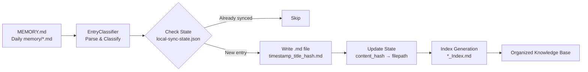

# Knowledge Management Skill (Local Storage)

Organize your OpenClaw memory files into a structured local knowledge base. Automatically parses `MEMORY.md` and daily memory files, classifies entries by content type, and stores each as a timestamped markdown file in the appropriate folder.

## Setup

No API keys needed! Just ensure your workspace structure exists:

```bash
mkdir -p ~/.openclaw/workspace/{Research,Decision,Insight,Lesson,Pattern,Project,Reference,Tutorial}
```

The skill will create folders automatically if missing.

## Tools

### `km sync`
Extract and store knowledge entries as markdown files.

**Options:**
- `--days_back <num>` (default: 7) — Include N days of daily files
- `--dry_run` — Preview without creating files
- `--limit <num>` — Max entries to process
- `--cleanup` — Delete orphan files (files in folders but not tracked in state)
- `--verbose` — Detailed logs

**Example:**
```bash
km sync --days_back 14 --dry_run
km sync --days_back 7 --cleanup
```

### `km classify`
Parse and classify entries without storing. Outputs JSON with full metadata.

**Options:**
- `--days_back <num>` (default: 0) — 0 = only MEMORY.md, otherwise include daily files

**Example:**
```bash
km classify --days_back 3 > entries.json
```

### `km summarize`
Create index files listing all entries in each content type folder.

**Options:**
- `--output_dir <path>` — Where to write index files (default: workspace root)

**Example:**
```bash
km summarize --output_dir ~/.openclaw/workspace
```

### `km cleanup`
Remove orphaned files (files in content folders that are not tracked in the sync state).

**Options:**
- `--dry_run` — Preview what would be deleted

**Example:**
```bash
km cleanup --dry_run
km cleanup
```

### `km list_types`
List all available content types and their descriptions.

**Example:**
```bash
km list_types
```

## Storage Structure

```
~/.openclaw/workspace/
├── Research/
│   ├── 20260215T1448_OpenClaw_Optimization_Findings_e4b30e75.md
│   └── 20260215T1448_Benchmark_Results_9de25742.md
├── Decision/
│   └── 20260215T1448_Multi_Agent_Architecture_Choice_8fb1b6ab.md
├── Insight/
│   └── 20260215T1448_Cost_Savings_Realization_3c76995.md
├── Lesson/
│   └── 20260215T1448_Security_Misconfiguration_Fix_401aa1e.md
├── Pattern/
│   └── 20260215T1448_Workflow_Automation_Trend_e73f2a4.md
├── Project/
│   └── 20260215T1448_NFT_Liquidity_Skill_Plan_9349f18.md
├── Reference/
│   └── 20260215T1448_OpenClaw_API_Cheatsheet_a70f85d.md
├── Tutorial/
│   └── 20260215T1448_Setup_Automated_Backups_Guide_7a41f8e.md
├── MEMORY.md
├── memory/
│   ├── 2026-02-15.md
│   ├── 2026-02-14.md
│   └── local-sync-state.json   (tracks content_hash → filepath)
└── Research_Index.md
    Decision_Index.md
    Insight_Index.md
    ... (other index files)
```

### Workflow Diagram



The diagram shows the complete sync pipeline from source memory files to the final organized folder structure with indexes.

### File Naming

Each entry gets a timestamp prefix with a content hash suffix:
```
YYYYMMDDTHHMM_Title_With_Underscores_HASH.md
```
Example: `202602151440_GitHub_Documentation_Standardization_Protocol_e4b30e75.md`

- Timestamp: `20260215T1440` (compact, sortable)
- Title is sanitized (invalid filesystem chars → `_`, spaces → `_`)
- 8-character content hash suffix prevents collisions when titles are identical
- Ensures chronological sorting while preserving distinct entries

### File Content

Each `.md` file uses YAML frontmatter for metadata:

```markdown
---
title: "GitHub Documentation Standardization Protocol"
content_type: "Research"
domain: "OpenClaw"
certainty: "Verified"
impact: "Medium"
confidence_score: 8
tags: ["AI", "Benchmark", "Automation"]
source: "MEMORY.md"
source_file: "MEMORY.md"
date: "2026-02-11"
content_hash: "e4b30e75d0f5a662"
---

Body content starts here...
```

## How It Works

1. **Parse** `MEMORY.md` and recent daily `memory/*.md` files
2. **Classify** each entry: content type, domain, certainty, impact, confidence score, tags
3. **Deduplicate** using content hash (MD5 of title+date+body_snippet)
4. **Check state** — skip already-synced entries
5. **Write file** to appropriate folder with timestamp + hash filename
6. **Update state** — record content_hash → filepath mapping
7. **Cleanup** (optional) — delete files no longer in sync state

## Classification Logic

- **Content Type:** Determined by keywords in title/body (Research, Lesson, Decision, Pattern, Tutorial, Reference, Insight)
- **Domain:** AI Models, OpenClaw, Cost Optimization, Trading, Learning, Process, General
- **Certainty:** Verified, Likely, Speculative, Opinion (based on phrasing)
- **Impact:** High, Medium, Low, Negligible (based on importance indicators)
- **Tags:** Auto-extracted from keyword map (AI, Automation, Cost, OpenRouter, etc.)
- **Confidence Score:** 1-10 based on source, length, data mentions

Customize these in the `EntryClassifier` class in `index-local.js`.

## State Management

The sync state (`memory/local-sync-state.json`) tracks which entries have been exported:

```json
{
  "e4b30e75d0f5a662": "/home/ubuntu/.openclaw/workspace/Research/202602151440_GitHub_Documentation_Standardization_Protocol_e4b30e75.md",
  "a70f85d63fa7f842": "/home/ubuntu/.openclaw/workspace/Reference/202602151440_GitHub_Collaborator_Access_Policy_a70f85d.md"
}
```

This enables:
- Idempotent syncs (no duplicates)
- Fast check before writing
- Easy cleanup of orphaned files

**Do not edit this file manually** unless you know what you're doing.

## Troubleshooting

**"Unknown tool" or "km: command not found"**
- Ensure `~/workspace/bin` is in your PATH, or call via full path: `/home/ubuntu/.openclaw/workspace/bin/km`
- Run `npm link` in the skill directory to register globally

**No entries found**
- Check your `MEMORY.md` structure: must have `##` section headers, then `###` entry titles under recognized sections
- Recognized sections: Research, Lesson, Decision, Pattern, Tutorial, Reference, Insight, etc.

**Files not created**
- Check write permissions on workspace folders
- Run with `--verbose` to see detailed logs
- Use `--dry_run` to see what would happen without writing

**Old entries not syncing**
- They may already be in sync state. Clear `memory/local-sync-state.json` to force full re-sync (will recreate all files with new timestamps)
- Better: Use `--dry_run` first to see skip messages

**Duplicate files with same name**
- This was a known issue (pre-Feb 15 14:50). Re-sync with `--cleanup` to regenerate with hash suffixes.

## Cron Integration

Automate regular syncs to keep your local knowledge base current.

**Via OpenClaw cron:**
```bash
openclaw cron add \
  --name "Local Knowledge Sync" \
  --expr "0 */6 * * *" \
  --sessionTarget isolated \
  --payload '{"kind":"agentTurn","message":"km sync --days_back 7 --cleanup"}'
```

**Via system crontab:**
```bash
0 */6 * * * export WORKSPACE=/home/ubuntu/.openclaw/workspace && /home/ubuntu/.openclaw/workspace/bin/km sync --days_back 7 --cleanup
```

---

**Version:** 2.0.0
**Changed:** 2026-02-15 — Switched from Notion to local file storage, added hash suffixes for filename uniqueness
**Author:** Claire (OpenClaw Agent)
**License:** MIT
